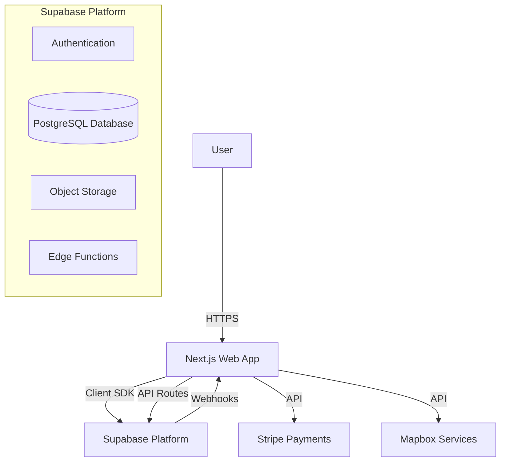

# Architecture Overview for BlockHyre Web App

This document serves as a critical, living template designed to equip agents with a rapid and comprehensive understanding of the `apps/web` codebase's architecture, enabling efficient navigation and effective contribution from day one. Update this document as the codebase evolves.

## 1. Project Structure

This section provides a high-level overview of the `apps/web` directory structure. The project is part of a monorepo (`BlockHyre_Monorepo`) managed by Turborepo.

```
apps/web/
├── app/                  # Next.js App Router (16.0.7) - Main application logic
│   ├── (auth)/           # Authentication flows (login, signup)
│   ├── api/              # API Routes (backend-for-frontend)
│   ├── components/       # App-specific components
│   ├── context/          # React Context providers (Auth, etc.)
│   ├── dashboard/        # Protected dashboard routes
│   ├── hooks/            # Custom React hooks
│   ├── lib/              # Utility functions and shared logic
│   ├── listings/         # Listing feature routes
│   ├── types/            # TypeScript type definitions
│   ├── layout.tsx        # Root layout
│   └── page.tsx          # Homepage
├── components/           # Reusable UI components
│   ├── ui/               # Radix UI + shadcn/ui primitives
│   └── shared/           # Business-logic specific components
├── hooks/                # Custom React hooks (e.g., `use-toast`)
├── lib/                  # Core utilities and client configurations
│   ├── supabase.ts       # Supabase client instantiation
│   ├── stripe.ts         # Stripe client helper
│   ├── location.ts       # Mapbox/Location utilities
│   └── utils.ts          # General helper functions (cn, clsx)
├── public/               # Static assets (images, fonts, icons)
├── supabase/             # Supabase specific configurations/migrations for the web app
├── middleware.ts         # Next.js Middleware for session handling and route protection
├── next.config.ts        # Next.js configuration
├── package.json          # Dependencies and scripts
└── tailwind.config.ts    # Tailwind CSS configuration
```

## 2. High-Level System Diagram

A simplified view of the system components and data flow:



## 3. Core Components

### 3.1. Frontend Application
**Name:** BlockHyre Web  
**Description:** The main user interface for the BlockHyre platform. It handles user authentication, listing discovery, booking management, and dashboard functionalities. Built with a component-driven architecture using React Server Components where applicable.  
**Technologies:**
- **Framework:** Next.js 16 (App Router)
- **Library:** React 19
- **Styling:** Tailwind CSS 4
- **UI Components:** Radix UI (Headless), Lucide React (Icons), Vaul (Drawer), Sonner (Toasts)
- **State Management:** URL state (`nuqs`), React Context, Local State, Supabase Realtime
- **Maps:** Mapbox GL
- **Payments:** Stripe

### 3.2. Backend Services
The backend logic is primarily serverless, leveraging Next.js API routes and Supabase's managed backend features.

#### 3.2.1. Next.js API Routes (`app/api`)
**Description:** Handles server-side logic that requires secure environments or third-party webhooks.
**Key Endpoints:**
- `/api/stripe/checkout`: Initiates Stripe Checkout sessions.
- `/api/stripe/webhook`: Handles Stripe webhooks securely.
- `/api/signup`: Enforces custom validation and rate limiting for account creation.

#### 3.2.2. Supabase Backend
**Description:** Acts as the primary backend-as-a-service, handling authentication, database interactions, and file storage.
**Key Features:**
- **Auth:** Manages user sessions and Row Level Security (RLS).
- **Database:** PostgreSQL for all application data.
- **Storage:** Buckets for user uploads (avatars, listing images).
- **Edge Functions:** Deno-based serverless functions for complex logic.

## 4. Messaging System

The platform features a real-time messaging system for communication between owners and renters.

### 4.1. Consolidated Chat Model
- **Relationship:** 1:1 relationship between any two users (Owner + Renter).
- **Consolidation:** All inquiries or bookings between the same two users are routed to a single, persistent chat thread regardless of the listing.
- **Contextual Awareness:** The `LISTING_INQUIRY` system message is used as a "topic header" in the unified thread whenever a user initiates contact for a specific tool.

### 4.2. Implementation
- **Real-time:** Powered by Supabase Broadcast channels for message delivery and Postgres Changes for notification syncing.
- **RPC Logic:** `upsert_conversation` handles the atomic lookup/creation of user-pair chats.
- **Templating:** Uses `system_message_templates` table with Liquid logic to render role-specific system notifications (confirmations, rejections, etc.).

## 5. Data Stores

### 5.1. Primary Database (PostgreSQL)
**Name:** BlockHyre Database (Supabase)  
**Type:** PostgreSQL  
**Purpose:** Stores all persistent application data including users, listings, bookings, and transactions.  
**Key Tables:** `users`, `listings`, `rentals`, `conversations`, `messages`, `favorites`.

### 5.2. Object Storage
**Name:** Supabase Storage  
**Type:** Object Store (S3-compatible)  
**Purpose:** Stores user-uploaded content.  
**Key Buckets:** `avatars`, `listing-images`.

## 6. External Integrations / APIs

### 6.1. Stripe
**Purpose:** Payment processing for rentals and deposits.  
**Integration Method:** Stripe Node.js SDK (API Routes) & Stripe.js (Client).

### 6.2. Mapbox
**Purpose:** Location services, geocoding, and map rendering for listings.  
**Integration Method:** Mapbox GL JS, Mapbox Geocoding API.

### 6.3. Supabase Auth
**Purpose:** User authentication and identity management.  
**Integration Method:** `@supabase/ssr` (Next.js middleware & server/client components).

## 7. Security Considerations

**Authentication:** 
- Powered by Supabase Auth (JWT-based).
- Protected routes via Next.js middleware using `@supabase/ssr`.

**Authorization:**
- **Row Level Security (RLS):** Policies defined directly on Postgres tables to restrict data access at the database level.
- **Middleware:** `middleware.ts` ensures protected routes redirect unauthenticated users.

**Data Protection:**
- Environment variables (`.env.local`) manage sensitive API keys (Stripe Secret Key, Supabase Service Role).
- HTTP Security Headers (CSP, HSTS, X-Frame-Options) as standard practice.

## 8. Deployment & Infrastructure

**Cloud Provider:** Vercel (Web App), Supabase (Backend/DB)  
**Monorepo Tooling:** Turborepo for build orchestration and caching.
**CI/CD Pipeline:** GitHub Actions.  

## 9. Development Environment

**Local Setup:**
1. Clone the repository.
2. Install dependencies: `pnpm install` (monorepo standard).
3. Set up environment variables in `.env.local` (Supabase URL/Key, Stripe Keys).
4. Run development server: `pnpm dev`.

**Local Backend:**
- Supabase local development via `supabase start` (requires Docker).

**Code Quality:**
- **Linting:** ESLint (`pnpm lint`).
- **Formatting:** Prettier (implied).

## 10. Future Considerations / Roadmap

- **Testing Strategy:** Implement comprehensive unit (Jest/Vitest) and E2E (Playwright) testing suites.
- **Enhanced Component Library:** Further abstracting UI components into a shared package within the monorepo (`packages/ui`).
- **Real-time Notifications:** Expand the messaging model to include push notifications and robust multi-device sync.
- **Accessibility:** Ensure full WCAG compliance (Radix UI provides a good baseline).

## 11. Project Identification

**Project Name:** BlockHyre Web  
**Repository Path:** `apps/web`  
**Primary Tech:** Next.js, Supabase, Tailwind CSS  
**Date of Last Update:** 2026-02-17

## 12. Glossary / Acronyms

**RLS:** Row Level Security (PostgreSQL security feature).
**SSR:** Server-Side Rendering.
**ISR:** Incremental Static Regeneration.
**RPC:** Remote Procedure Call (Supabase functions).
