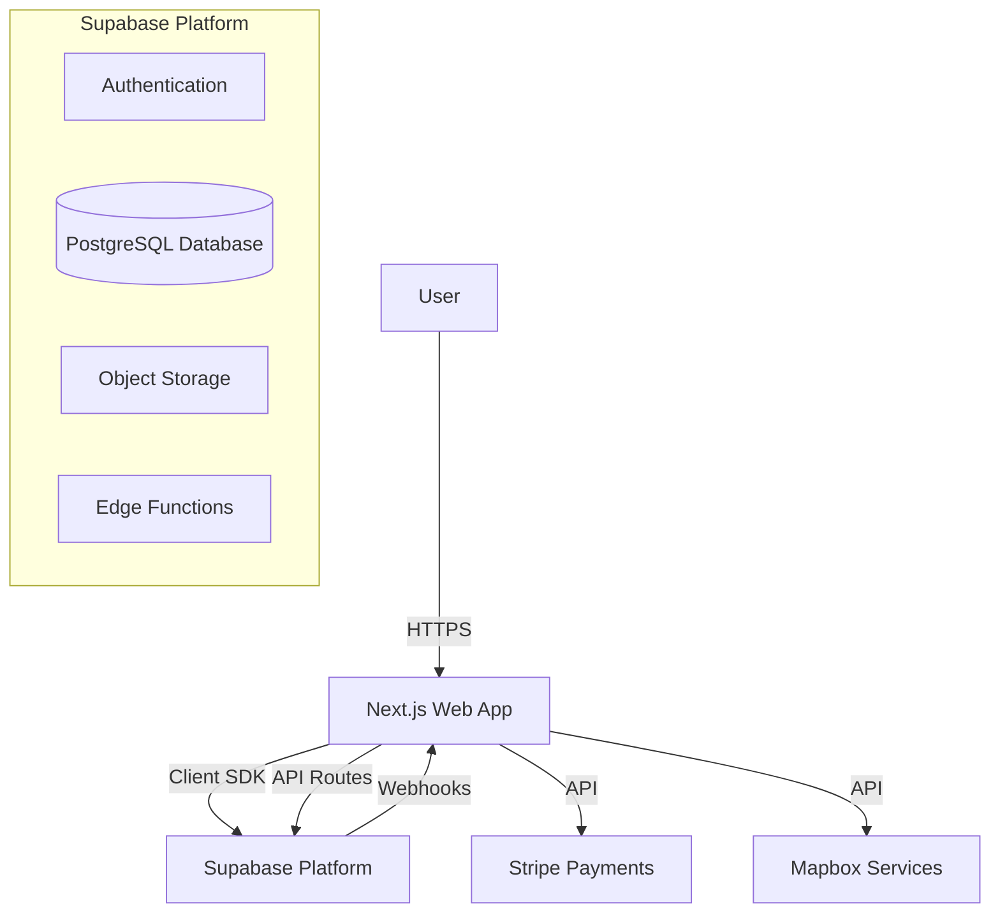

# Architecture Overview for BlockHyre Web App

This document serves as a critical, living template designed to equip agents with a rapid and comprehensive understanding of the `apps/web` codebase's architecture, enabling efficient navigation and effective contribution from day one. Update this document as the codebase evolves.

## 1. Project Structure

This section provides a high-level overview of the `apps/web` directory structure.

```
apps/web/
├── .github/              # GitHub workflows/actions
├── .next/                # Next.js build output (gitignored)
├── app/                  # Next.js App Router (pages & layouts)
│   ├── (auth)/           # Authentication routes (group)
│   ├── api/              # API Routes (backend-for-frontend)
│   ├── components/       # App-specific components
│   ├── dashboard/        # Dashboard feature routes
│   ├── hooks/            # Custom React hooks
│   ├── lib/              # Utility functions and shared logic
│   ├── listings/         # Listing feature routes
│   ├── supabase/         # Supabase client instances
│   ├── layout.tsx        # Root layout
│   └── page.tsx          # Homepage
├── components/           # Reusable UI components (shadcn/ui, base components)
│   └── ui/               # Primitive UI components
├── docs/                 # Documentation files
├── hooks/                # Global custom hooks
├── lib/                  # Shared libraries and utilities
│   ├── supabase/         # Supabase client customization
│   └── utils.ts          # Helper functions
├── public/               # Static assets (images, fonts, icons)
├── scripts/              # Utility scripts (db checks, etc.)
├── supabase/             # Supabase configuration
│   ├── functions/        # Supabase Edge Functions
│   └── migrations/       # Database migrations
├── types/                # TypeScript type definitions
├── next.config.ts        # Next.js configuration
├── package.json          # Dependencies and scripts
└── tailwind.config.ts    # Tailwind CSS configuration
```

## 2. High-Level System Diagram

A simplified view of the system components and data flow:



## 3. Core Components

### 3.1. Frontend Application
**Name:** BlockHyre Web  
**Description:** The main user interface for the BlockHyre platform. It handles user authentication, listing discovery, booking management, and dashboard functionalities. Built with a component-driven architecture using React Server Components where applicable.  
**Technologies:**
- **Framework:** Next.js 16 (App Router)
- **Library:** React 19
- **Styling:** Tailwind CSS 4
- **UI Components:** Radix UI (Headless), Lucide React (Icons)
- **State Management:** URL state (`nuqs`), React Context, Local State
- **Maps:** Mapbox GL
- **Payments:** Stripe

**Deployment:** Vercel (assumed standard Next.js deployment) or Docker container.

### 3.2. Backend Services (Serverless)
**Name:** Supabase Backend  
**Description:** Provides backend-as-a-service functionality including authentication, database, and storage.  
**Technologies:**
- **Database:** PostgreSQL
- **Auth:** GoTrue (Supabase Auth)
- **Storage:** Supabase Storage (S3-compatible)
- **Edge Functions:** Deno-based serverless functions for complex logic.

**Deployment:** Supabase Cloud.

## 4. Data Stores

### 4.1. Primary Database
**Name:** BlockHyre Database (Supabase)  
**Type:** PostgreSQL  
**Purpose:** Stores all persistent application data.  
**Key Tables:**
- `users` (profiles)
- `listings` (rental items)
- `bookings` (rental transactions)
- `messages` (user communication)
- `reviews` (feedback)

### 4.2. Object Storage
**Name:** Supabase Storage  
**Type:** Object Store (S3-compatible)  
**Purpose:** Stores user-uploaded content.  
**Key Buckets:**
- `avatars` (user profile pictures)
- `listing-images` (photos of rental items)
- `documents` (verification docs, if applicable)

## 5. External Integrations / APIs

### 5.1. Stripe
**Purpose:** Payment processing for rentals and deposits.  
**Integration Method:** Stripe Node.js SDK (API Routes) & Stripe.js (Client).

### 5.2. Mapbox
**Purpose:** Location services, geocoding, and map rendering for listings.  
**Integration Method:** Mapbox GL JS, Mapbox Geocoding API.

### 5.3. Supabase Auth
**Purpose:** User authentication and identity management.  
**Integration Method:** `@supabase/ssr` (Next.js middleware & server/client components).

## 6. Deployment & Infrastructure

**Cloud Provider:** Vercel (Web App), Supabase (Backend/DB)  
**CI/CD Pipeline:** GitHub Actions (implied by `.github` folder directory).  
**Monitoring & Logging:**
- Next.js Analytics / Vercel Analytics (potential).
- Supabase Logs (Database & Auth logs).

## 7. Security Considerations

**Authentication:** 
- Powered by Supabase Auth (Email/Password, OAuth providers like Google, GitHub).
- Protected routes via Next.js middleware using `@supabase/ssr`.

**Authorization:**
- Row Level Security (RLS) policies in PostgreSQL to restrict data access at the database level.
- Server-side checks in API routes and Server Actions.

**Data Protection:**
- Environment variables (`.env.local`) for sensitive keys (e.g., `STRIPE_SECRET_KEY`, `SUPABASE_SERVICE_ROLE_KEY`).
- HTTP Security Headers configured in `next.config.ts` (CSP, HSTS, X-Frame-Options).

## 8. Development & Testing Environment

**Local Setup:**
1. Clone the repository.
2. Install dependencies: `npm install` (or `pnpm`/`yarn`/`bun`).
3. Set up environment variables in `.env.local`.
4. Run development server: `npm run dev`.

**Linting & Formatting:**
- ESLint (configured in `eslint.config.mjs`).
- Prettier (implied usage).

**Testing:**
- Currently minimal/manual testing. (Future: Jest/Vitest for unit tests, Playwright for E2E).

## 9. Future Considerations / Roadmap

- **Testing Strategy:** Implement comprehensive unit and E2E testing suites.
- **Real-time Features:** Enhance messaging and notifications using Supabase Realtime.
- **Performance Optimization:** Further optimize image loading (Next.js Image) and route prefetching.
- **Accessibility:** Ensure full WCAG compliance (Radix UI provides a good baseline).

## 10. Project Identification

**Project Name:** BlockHyre Web  
**Repository Path:** `apps/web`  
**Primary Tech:** Next.js, Supabase, Tailwind CSS  
**Date of Last Update:** 2026-02-17
